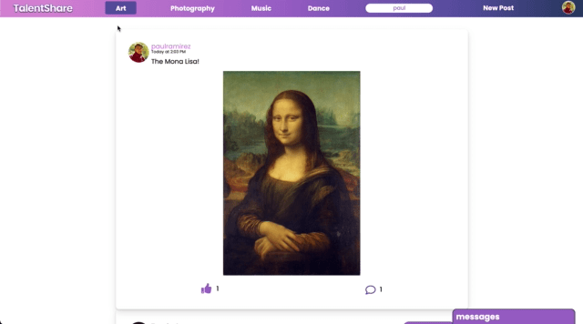
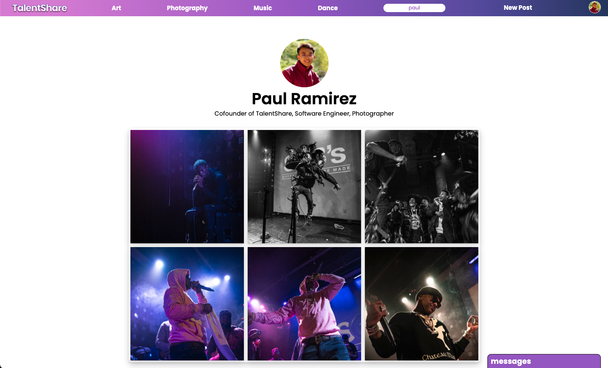
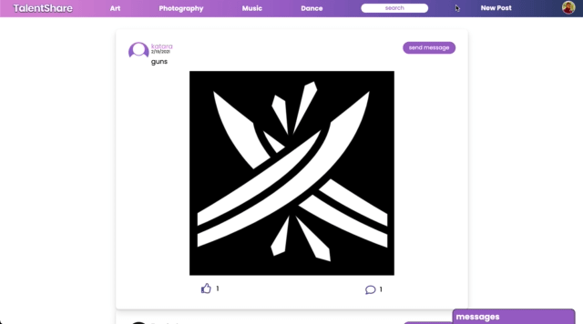
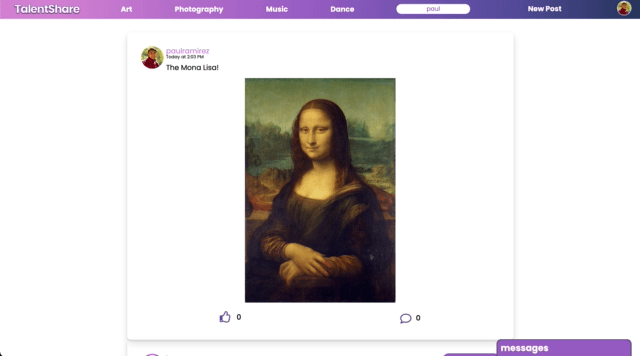
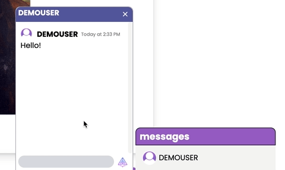

<div align="center">
  
</div>

## **Background and Overview**

TalentShare is a social media application with a focus on user-generated content that revolves around art, photography, music, and dance. It provides a platform for creatives to showcase their work, gain exposure, and chat with their fans.

[Live Demo](https://talentshare-aa.herokuapp.com/#/)

## **Functionality and MVP**

- Users can create accounts to browse talent feeds; Options include art, photography, music, and dance (All categories are combined by default)

<br/>

<div align="center">
  
</div>

<br/>

- Artists have their own portfolio pages and can create posts that belong to a specific category
  - Posts can be any file type (audio/video/image) and will be rendered accordingly

<br/>

<div align="center">
  
</div>

<br/>

<div align="center">
  
</div>

<br/>

- Users can like and comment on posts

 <br/>

<div align="center">
  
</div>

<br/>

- Users can live chat with artists

<br/>
 
<div align="center">
  
</div>

<br/>

## **Technologies and Challenges**

### _Backend_

- MongoDB
- Express.js
- Node.js
- Mongoose

### _Frontend_

- React
- Redux

### _Realtime Communication_

- WebSocket

A challenge our team encountered was quickly and efficiently filtering through posts to generate category specific feeds. We decided to make a single axios request to our backend to fetch every post in the database whenever a user logs in. To show all the posts that belong to a category, we filter the posts shown by using the posts that already exist in our state and taking advantage of React Router's location and pathname attributes.

```javascript
render() {
  return (
    <div className="main-index-component">
      <PostIndex posts={this.props.posts.filter(post => {
        switch(this.props.location.pathname){
          case "/browse":
            return true;
          case "/browse/Art":
            return post.category === "Art";
          case "/browse/Photography":
            return post.category === "Photography";
          case "/browse/Music":
            return post.category === "Music";
          case "/browse/Dance":
            return post.category === "Dance";
        }
      })} />
    </div>
  );
}
```

Another challenge we encountered was implementing the ability for users to seamlessly edit posts and the basic information on their portfolio page. The snippet below specifically demonstrates editing portfolio pages. To allow users to update their profile picture, we first send a request to upload an image and fetch it. We then send the fetched data alongside the request to update the specific user. The process is similar for editing posts.

```javascript
handleSubmit(e) {
    e.preventDefault();
    const formData = new FormData();
    formData.append('file', this.state.file);
    formData.append('caption', "profile-pic");
    if (this.state.file) {
        this.props.sendFile(formData).then(() => this.props.updateUser({
            username: this.state.username,
            firstname: this.state.firstname,
            lastname: this.state.lastname,
            propic: this.props.content.filename,
            bio: this.state.bio,
            _id: this.state._id
        })).then(this.props.closeModal);
    } else {
        this.props.updateUser({
            username: this.state.username,
            firstname: this.state.firstname,
            lastname: this.state.lastname,
            propic: this.state.propic,
            bio: this.state.bio,
            _id: this.state._id
        }).then(this.props.closeModal);
    }
}
```

## **Team**

- **Team Lead**: Azim Siddiki
- **Backend Lead**: Tasnim Saiduzzaman
- **Frontend Lead**: Paul Ramirez
- **Flex**: Stephen Yang
